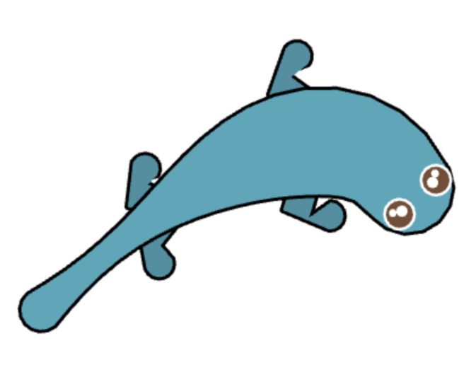

# Rust Procedural Animation

A basic procedural animation written in [Rust](https://www.rust-lang.org/) using
the [Macroquad](https://github.com/not-fl3/macroquad) library.

<p align="left">
    
</p>

You can view the browser build on [GitHub
pages](https://battesonb.github.io/rust-procedural-animation/) or pull this down
and build it locally to run on desktop with:

```sh
cargo run --release
```
